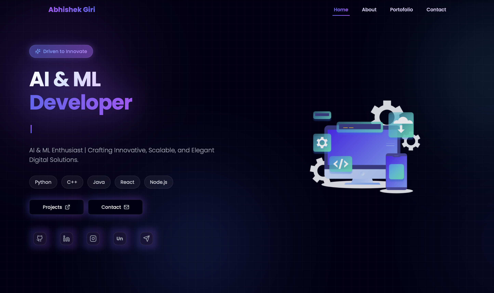
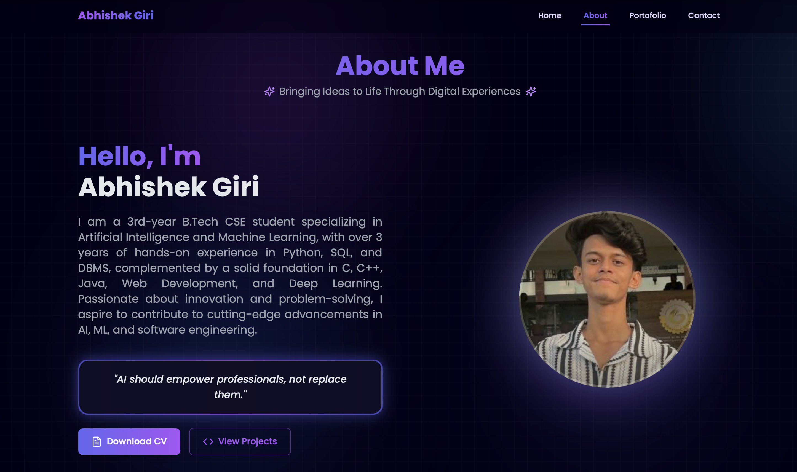
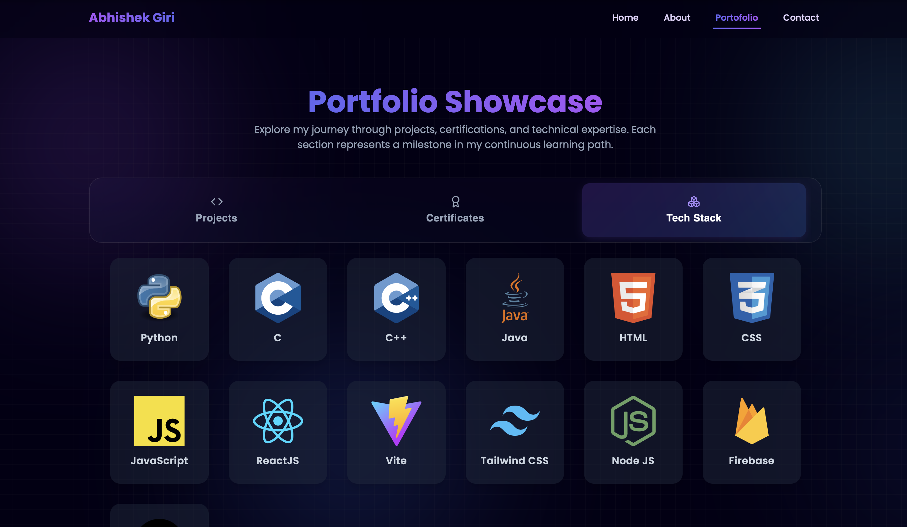
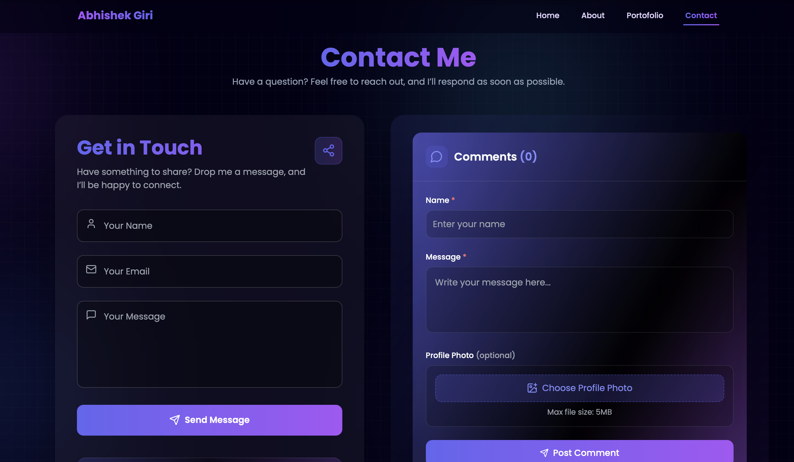

<h1 align="center">🚀 Portfolio-Abhinova — Modern Developer Portfolio</h1>

<p align="center">
  ✨ A comprehensive personal portfolio website showcasing skills, projects, and professional journey as an AI & ML Developer with modern web technologies and interactive user experience.
</p>

<p align="center">
  
  
  
  
  
  
</p>
<br>

---

## 📖 About This Portfolio
A modern, responsive portfolio website built to showcase my journey as an AI & ML developer. Features interactive animations, real-time comments system, and comprehensive project showcase with detailed information about my technical expertise and professional achievements.

<br>

---

## 💡 Key Features
Portfolio-Abhinova is designed to provide:

- 🎨 Modern UI/UX with smooth animations and transitions
- 📱 Fully responsive design for all devices
- 🔥 Real-time comments system with local storage
- 📊 Interactive project showcase with detailed information
- 🎯 Professional skills and technology stack display
- 📧 Contact form with email integration
- 🌟 Certificate gallery with modal view
- ⚡ Fast loading with optimized performance
<br>

---  

## 🚀 Features

✅  **Interactive Welcome Screen** with typewriter effects  
✅  **Dynamic Project Portfolio** with 25+ projects showcase  
✅  **Real-time Comments System** with local storage  
✅  **Professional About Section** with animated statistics  
✅  **Skills & Technology Stack** with interactive icons  
✅  **Certificate Gallery** with modal preview  
✅  **Contact Form** with FormSubmit integration  
✅  **Social Media Integration** with all platforms  
✅  **Responsive Design** for mobile and desktop  
✅  **SEO Optimized** with meta tags and descriptions

<br>

---  

## 🛠️ Tech Stack

<div align="center">

<table>
<thead>
<tr>
<th>🖥️ Technology</th>
<th>⚙️ Description</th>
</tr>
</thead>
<tbody>
<tr>
<td></td>
<td>Modern frontend with component architecture</td>
</tr>
<tr>
<td></td>
<td>Fast build tool and development server</td>
</tr>
<tr>
<td></td>
<td>Utility-first CSS framework for styling</td>
</tr>
<tr>
<td></td>
<td>Browser storage for comments system</td>
</tr>
<tr>
<td></td>
<td>Advanced animations and transitions</td>
</tr>
<tr>
<td></td>
<td>UI components and design system</td>
</tr>
<tr>
<td></td>
<td>Animate On Scroll library</td>
</tr>
</tbody>
</table>

</div>

<br>

---

## 📁 Project Directory Structure

```
Portfolio-Abhinova/
├── 📂 public/                     # 🎨 Static assets and resources
│   ├── 📂 icons/                 # 🔧 Technology stack icons
│   ├── 📂 certificates/          # 🏆 Professional certificates
│   ├── 📂 assets/                # 🖼️ Images and animations
│   └── 📄 AbhishekGiriResume.pdf # 📄 Professional resume
├── 📂 src/                       # 💻 Source code directory
│   ├── 📂 components/            # 🧩 Reusable UI components
│   │   ├── 📄 Navbar.jsx         # 🔝 Navigation component
│   │   ├── 📄 Background.jsx     # 🌌 Animated background
│   │   ├── 📄 CardProject.jsx    # 📋 Project card component
│   │   ├── 📄 Certificate.jsx    # 🏆 Certificate modal
│   │   ├── 📄 Commentar.jsx      # 💬 Comments system
│   │   ├── 📄 SocialLinks.jsx    # 🔗 Social media links
│   │   ├── 📄 ProjectDetail.jsx  # 📊 Project details page
│   │   ├── 📄 TechStackIcon.jsx  # 🛠️ Technology icons
│   │   └── 📄 projects.jsx       # 📁 Projects data
│   ├── 📂 Pages/                 # 📄 Main application pages
│   │   ├── 📄 Home.jsx           # 🏠 Landing page
│   │   ├── 📄 About.jsx          # ℹ️ About section
│   │   ├── 📄 Portofolio.jsx     # 💼 Portfolio showcase
│   │   ├── 📄 Contact.jsx        # 📧 Contact form
│   │   └── 📄 WelcomeScreen.jsx  # 👋 Welcome animation
│   ├── 📄 App.jsx                # 🚀 Main application
│   ├── 📄 main.jsx               # 🎯 Application entry point
│   └── 📄 index.css              # 🎨 Global styles
├── 📂 docs/                      # 📸 Documentation and screenshots
│   ├── 📄 Home_Page.png          # 🏠 Home page screenshot
│   ├── 📄 About_Page.png         # ℹ️ About page screenshot
│   ├── 📄 Portfolio_Showcase.png # 💼 Portfolio page screenshot
│   └── 📄 Contact_Page.png        # 📧 Contact page screenshot
├── 📄 package.json               # 📦 Dependencies and scripts
├── 📄 vite.config.js             # ⚙️ Vite configuration
├── 📄 tailwind.config.js         # 🎨 Tailwind configuration
├── 📄 .gitignore                 # 🚫 Git ignore rules
└── 📄 README.md                  # 📖 Project documentation
```
<br>

---

## 📸 Preview Images

| 📍 Page / Feature            | 📸 Screenshot                                              |
|:----------------------------|:-----------------------------------------------------------|
| Home Page                   |                    |
| About Section               |           |
| Portfolio Showcase          |     |
| Contact Form                |   |

<br>

---

## 📦 How to Run

### 📌 Prerequisites
- ✅ **Node.js 18+** installed
- ✅ **npm** or **yarn** package manager
- ✅ **Git** for version control
- ✅ **Modern browser** (for local storage)

<br>

---  

### 🚀 Quick Start

1. **Clone the repository:**

   ```bash
   git clone https://github.com/AbhishekGiri04/Portfolio-Abhinova.git
   cd Portfolio-Abhinova
   ```

2. **Install dependencies:**

   ```bash
   npm install
   ```
   
   Or if you encounter peer dependency issues:
   
   ```bash
   npm install --legacy-peer-deps
   ```

3. **Start development server:**

   ```bash
   npm run dev
   ```

4. **Open in browser:**

   ```
   http://localhost:5173
   ```

### 🏗️ Build for Production

```bash
npm run build
```

The build files will be generated in the `dist/` folder.

### 🔧 Troubleshooting

If you encounter issues:

```bash
# Clear node modules and reinstall
rm -rf node_modules package-lock.json
npm install

# Clear Vite cache
npm run dev -- --force
```
<br>

---

## 💬 Comments System

The portfolio features a local storage-based comments system:

- **No Setup Required** - Works out of the box
- **Local Storage** - Comments saved in browser
- **Email Notifications** - Automatic email alerts for new comments
- **Admin Controls** - Clear all comments functionality
- **Profile Photos** - Support for user profile images
- **Real-time Display** - Instant comment posting

<br>

---

## 📊 Project Statistics

- **25+ Projects** — Comprehensive project showcase
- **9 Certificates** — Professional certifications
- **10+ Technologies** — Modern tech stack
- **100% Responsive** — Mobile-first design
- **Real-time Comments** — Interactive user engagement
- **SEO Optimized** — Search engine friendlygagement
- **SEO Optimized** — Search engine friendly

<br>

---

## 🌱 Future Enhancements
- 📱 **Progressive Web App** — PWA implementation
- 🌍 **Multi-language Support** — Internationalization
- 📊 **Analytics Dashboard** — Visitor analytics
- 🔐 **Admin Panel** — Content management system
- 🎨 **Theme Switcher** — Dark/Light mode toggle
- 📧 **Newsletter** — Email subscription system

<br>

---  

## 📞 Help & Contact  

> 💬 *Got questions or want to collaborate?*  
> Feel free to reach out for technical discussions and opportunities!

<div align="center">

**👤 Abhishek Giri**  
<a href="https://www.linkedin.com/in/abhishek-giri04/">
  
</a>  
<a href="https://github.com/AbhishekGiri04">
  
</a>  
<a href="https://t.me/AbhishekGiri7">
  
</a>

<br/>

---

**🚀 Built with ❤️ for Innovation**  
*Showcasing AI & ML Excellence Through Modern Web Development*

</div>

---

<div align="center">

**© 2025 Abhishek Giri. All Rights Reserved.**  
**Portfolio Website - [www.AbhishekGiri.com](https://www.AbhishekGiri.com/)**

</div>  
